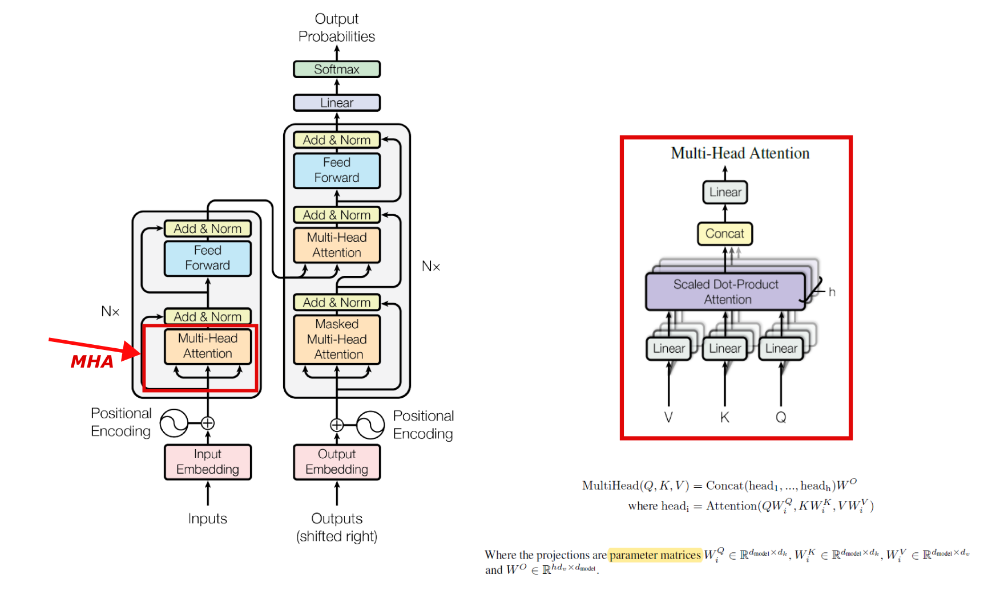

# eigenDNN -- An Open-source Toy DL Testing Framework.
To clone this repo, use
```
git clone --recursive

cd ./eigen
git checkout 3.4   # use eigen 3.4 required by EigenRand

git clone https://github.com/pytorch/pytorch --recursive && cd pytorch
git submodule sync
git submodule update --init --recursive

cd pytorch
export USE_CUDA=False
export BUILD_TEST=False
python ./tools/build_libtorch.py

```
Copy the following folders to `libtorch/include`
- `pytorch/torch/include/torch`
- `pytorch/torch/include/caffe2`
- `pytorch/torch/include/c10`
- `pytorch/torch/include/ATen`
- `pytorch/torch/include/TH*`

Copy the following shared library to  `libtorch/lib`. 
- `pytorch/build/lib/libtorch.so`
- `pytorch/build/lib/libtorch_cpu.so`
- `pytorch/build/lib/libc10.so`

Copy `pytorch/torch/share/cmake` to  `libtorch/share`. 

Finally, you will get the libtorch subdirectory as follows.
```
libtorch
├─include
│ ├─ATen
│ ├─c10
│ ├─caffe2
│ ├─TH
│ ├─THCUNN
│ ├─THNN
│ └─torch
├─lib
│ ├─libc10.so
│ ├─libtorch.so
│ └─libtorch_cpu.so
└─share
  └─cmake
```
In short, you can use the following cli command to do the above operations. In the folder (project source folder) where `/pytorch` locates,
```
mkdir libtorch && mkdir libtorch/lib && mkdir libtorch/include && mkdir libtorch/share
cp -r pytorch/torch/include/torch pytorch/torch/include/caffe2 pytorch/torch/include/c10 pytorch/torch/include/ATen pytorch/torch/include/TH* libtorch/include
cp pytorch/build/lib/libtorch.so pytorch/build/lib/libtorch_cpu.so pytorch/build/lib/libc10.so libtorch/lib
cp -r pytorch/torch/share/cmake libtorch/share
```
## Introduction
nnTest mainly focuses on providing a testing framework for train and inference Deep Neural Networks using YOUR OWN LIBRARY.

eigenDNN
* libtorch (built from pytorch directly) serves as the computation library that generates ground truth for your own library implementation.
* Eigen serves as the computation library that generates ground truth for GPU implementations.


What is to be initialized:
* weights
* input data
* target data

What is to be tested:
* forward result of the network output
* forward result of the potential intermediate variables
* backward gradients of the weights
* backward gradients of potential intermediate variables 

Currently, it focuses on

* Forward and backward of Multi-Head Attention (MHA).
  * with a pytorch `mha.py` that illustrates the multi-head attention our eigenDNN / cuTransDNN implements
  

<center></center>
<center>Which part will we implement in the transformer model.</center>

## Notes
### MSE Loss Function

Loss function, as the origin of DL system, is a basic component inside a DL system.

<center></center>
<center> MSE Loss.</center>


```
eidnnStatus_t eidnnMSELoss(
    eidnnHandle_t handle,
    const Tensor<float, 3> &output, 
    const Tensor<float, 3> &target,
    Tensor<float, 0> &loss,
    Tensor<float, 3> &d_loss);
```

### Linear
cuDNN has no specific APIs for linear layer.

In eiDNN, we have

```
eidnnStatus_t eidnnLinearForward(eidnnHandle_t handle,
                    const Tensor<float, 3>& x, // data
                    const Tensor<float, 2>& w, // weight
                    const Tensor<float, 1>& bias, // bias
                    Tensor<float, 3>& y);
```

```
eidnnStatus_t eidnnLinearBackward(eidnnHandle_t handle,
                     const Tensor<float, 3>& dy,
                     const Tensor<float, 3>& x,
                     const Tensor<float, 2>& w,
                     Tensor<float, 3>& dx, // gradient of input data
                     Tensor<float, 2>& dw // accumulated gradient of input weight
                     );
eidnnStatus_t eidnnLinearBackward(eidnnHandle_t handle,
                     const Tensor<float, 3>& dy,
                     const Tensor<float, 3>& x,
                     const Tensor<float, 2>& w,
                     Tensor<float, 3>& dx, // gradient of input data
                     Tensor<float, 2>& dw, // accumulated gradient of weight
                     Tensor<float, 1>& dbias // accumulated gradient of bias
                     );
```

### MatMul

$$ C = \beta * C + \alpha*Op_c(MatMul(Op_a(A),Op_b(B))) $$

, where $Op_m(M)$ is whether to transpose matrix $M$ or not in the forward pass.

cuDNN has no specific APIs for matrix-multiply operation.

In eiDNN, we have

```
eidnnStatus_t eidnnStridedBatchedGemmForward(
    eidnnHandle_t handle,
    float alpha,
    float beta,
    bool trans_A, // Op_a
    bool trans_B, // Op_b
    bool trans_C, // Op_c
    const Tensor<float, 4> &A, 
    const Tensor<float, 4> &B, 
    Tensor<float, 4> &C);
```

```
eidnnStatus_t eidnnStridedBatchedGemmBackward(
    eidnnHandle_t handle,
    float alpha,
    float beta,
    bool trans_A, // Op_a
    bool trans_B, // Op_b
    bool trans_C, // Op_c
    const Tensor<float, 4> &A, // A
    const Tensor<float, 4> &B, // B
    const Tensor<float, 4> &d_C, // gradient of C
    Tensor<float, 4> &d_A, // gradient of A
    Tensor<float, 4> &d_B // gradient of B
    );
```
### Softmax
cuDNN has the following APIs for softmax operation.
* [cudnnSoftmaxForward()](https://docs.nvidia.com/deeplearning/cudnn/api/index.html#cudnnSoftmaxForward)
* [cudnnSoftmaxBackward()](https://docs.nvidia.com/deeplearning/cudnn/api/index.html#cudnnSoftmaxBackward)

In eiDNN, we have

```
eidnnStatus_t eidnnSoftmaxForward(eidnnHandle_t handle,
                    eidnnSoftmaxAlgorithm_t algo,
                    eidnnSoftmaxMode_t mode,
                    const Tensor<float, 4>& x,
                    Tensor<float, 4>& y);
```

```
eidnnStatus_t eidnnSoftmaxBackward(eidnnHandle_t handle,
                     eidnnSoftmaxAlgorithm_t algo,
                     eidnnSoftmaxMode_t mode,
                     const Tensor<float, 4>& y,
                     const Tensor<float, 4>& dy,
                     Tensor<float, 4>& dx);
```

### Dropout
cuDNN has the following APIs for dropout operation.
* [cudnnCreateDropoutDescriptor()]()
* [cudnnDestroyDropoutDescriptor()]()
* [cudnnDropoutGetStatesSize()]()
* [cudnnDropoutGetReserveSpaceSize()]()
* [cudnnDropoutForward()]()
* [cudnnGetDropoutDescriptor()]()
* [cudnnRestoreDropoutDescriptor()]()
* [cudnnSetDropoutDescriptor()]()
* [cudnnDropoutBackward()]()

In eiDNN, we have

```
// dropout rate, 
// pointer to memory space of states (allocated by forward pass), 
// size of memory space in bytes (calculated by forward pass), 
// random seed
using eidnnDropoutDescriptor_t = std::tuple<float, void*, size_t, unsigned long long>; 
```
```
eidnnStatus_t eidnnDropoutForward(
    eidnnHandle_t                       handle,
    eidnnDropoutDescriptor_t      &dropoutDesc,
    const Tensor<float, 4>         &x, // input data
    Tensor<float, 4>               &y // input data after dropout
    );
```

```
eidnnStatus_t eidnnDropoutBackward(
    eidnnHandle_t                   handle,
    const eidnnDropoutDescriptor_t  dropoutDesc,
    const Tensor<float, 4>       &dy, // gradient of dropout output data
    Tensor<float, 4>             &dx // gradient of dropout input data
    );
```

### Multi-head Attention
cuDNN has the following APIs for MHA operations
* [cudnnCreateAttnDescriptor()]()
* [cudnnSetAttnDescriptor()]()
* [cudnnGetAttnDescriptor()]()
* [cudnnSetAttnDescriptor()]()
* [cudnnDestroyAttnDescriptor()]()
* [cudnnGetMultiHeadAttnBuffers()]()
* [cudnnGetMultiHeadAttnWeights()]()
* [cudnnMultiHeadAttnForward()]()
* [cudnnMultiHeadAttnBackwardData()]()
* [cudnnMultiHeadAttnBackwardWeights()]()
In eiDNN, we have

